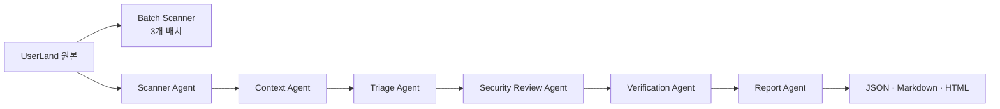

# BugBori — AI 기반 Multi-Agent SAST for Raspberry Pi UserLand

> 버그보리는 대규모 C/C++ 저장소를 분할 탐색하고, 위험 함수 후보를 코드 문맥과 원문 근거로 검증하는 역할 기반 SAST 워크플로입니다.

[GitHub 저장소](https://github.com/yeong-yi/ai-sast-userland) · [통합 제출 리포트](reports/FINAL_SUBMISSION_REPORT.md) · [발표 PDF](reports/AI_Multi_Agent_SAST_UserLand.pdf)

## 프로젝트 목표

Raspberry Pi UserLand처럼 큰 C/C++ 저장소는 전체 코드를 한 번에 분석하기 어렵고, 단순 위험 함수 검색은 오탐과 중복이 많습니다. 이 프로젝트는 위험 호출을 곧바로 취약점으로 확정하지 않고, 다음 순서로 검토합니다.

```text
후보 탐지 → 제한된 코드 문맥 수집 → 중복 통합·우선순위화
→ 사람 검토 근거 기록 → 원문 인용 검증 → Markdown/HTML 보고서
```

## 핵심 결과

| 항목 | 결과 |
|---|---:|
| 분석 파일 | 654개 C/C++ 파일 |
| 코드 규모 | 약 235,816줄 |
| 안정 배치 | 3개 |
| 검토 후보 | 583개 |
| 생성 문맥 묶음 | 583개 |
| 정밀 검토 | 10건 (원본 후보 11개) |
| 원문 대조 인용 | 62개 |
| 제출 검증 | 12개 통과, 실패 0개 |

정밀 검토 결과는 **취약 가능성 높음 1건, 낮음 8건, 정보 부족 1건**입니다. 이는 코드 근거에 따른 검토 결과이며, 실제 공격 성공이나 권한 상승을 증명한 결과가 아닙니다.

## 발견한 취약 가능성

이 프로젝트는 단순히 위험 함수 이름을 찾는 데서 끝나지 않고, 실제 취약 가능성이 있는 후보를 코드 근거로 좁히는 것을 목표로 합니다. 전체 583개 후보를 탐지한 뒤 높은 우선순위 후보 11개를 분석했고, 그 결과 1건을 **취약 가능성 높음**으로 판정했습니다.

### AN-010 — 명령행 입력의 `strcpy` 경계 초과 가능성

- 위치: `target/userland/helpers/dtoverlay/dtoverlay.c:1852`, `:1859`
- 확인한 경로: 명령행 매개변수 값 → `dtoverlay_apply_override` → `dtoverlay_foreach_override_target` → `strcpy(target_value, override_value)`
- 근거: 길이 제한이 없는 문자열이 256바이트 `target_value` 배열에 복사되는 경로를 원문 인용으로 확인
- 판정: **취약 가능성 높음** (신뢰도 97)

이 결과는 정적 코드 근거에 한정됩니다. 실제 공격 성공, 권한 상승, 실행 파일의 스택 보호 적용 여부는 아직 동적 검증하지 않았으므로 “확정 취약점”으로 표현하지 않습니다. 상세 인용과 반대 근거는 [보안 분석 보고서](reports/security_report.md)와 [통합 제출 리포트](reports/FINAL_SUBMISSION_REPORT.md)에 있습니다.

## 아키텍처



| Agent | 역할 | 주요 산출물 |
|---|---|---|
| Scanner | 위험 함수 호출을 검토 후보로 탐지 | `candidates.json` |
| Context | 포함 함수·인자·호출 관계·주변 코드 수집 | `context_bundles.json` |
| Triage | 높은 우선순위 선정, 동일 원인 중복 통합 | `triage_selection.json` |
| Security Review | 입력 경로·크기·종료·방어 로직 검토 | `security_review_responses.json` |
| Verification | 파일·줄 번호·원문 인용·과장 결론 검증 | `analysis_results.json` |
| Report | 검증 결과·실행 로그·HTML 보고서 생성 | `reports/*.md`, `reports/*.html` |

외부 LLM API는 사용하지 않았습니다. 보안 의미 분석 10건은 `human_provided_review`로 출처를 명시하고, 프로그램은 인용·줄 번호·구조를 결정론적으로 검증합니다.

## 빠른 실행

### 1. 분석 대상 원본 준비

UserLand 원본은 이 저장소에 포함하지 않습니다. 아래 명령으로 공식 원본을 `target/userland`에 복제합니다.

```powershell
.\setup_target.ps1
```

### 2. 전체 분석과 제출 문서 생성

Python 3만 필요하며 외부 패키지는 사용하지 않습니다.

```powershell
python src/batch_scanner.py
python src/agent_pipeline.py
python src/generate_submission_docs.py
python src/validate_submission.py
```

Windows Python Launcher를 쓴다면 `python` 대신 `py -3`을 사용합니다. `agent_pipeline.py`는 Scanner → Context → Triage → Security Review → Verification → Report 순으로 실행합니다.

### 3. 결과 확인

- 최종 제출 리포트: [reports/FINAL_SUBMISSION_REPORT.md](reports/FINAL_SUBMISSION_REPORT.md)
- 보안 분석: [reports/security_report.md](reports/security_report.md)
- 제출 검증: [reports/validation_report.md](reports/validation_report.md)
- 역할별 실행 로그: [reports/agent_run_log.md](reports/agent_run_log.md)

## 대규모 저장소와 토큰 절약 설계

| 설계 | 적용 방식 | 이유 |
|---|---|---|
| 코드 분할 | 경로와 코드량 기준 3개 안정 배치 | 거대 저장소를 누락 없이 나눔 |
| 우선순위화 | 583개 후보 중 high 후보를 먼저 Triage | 정밀 분석 비용을 위험한 위치에 집중 |
| 문맥 제한 | 후보 함수 140줄, 전체 묶음 220줄 | 필요한 근거를 남기면서 입력 상한 유지 |
| 호출 관계 제한 | 호출자 2개, 피호출자 3개 코드 우선 포함 | 호출 그래프 폭발 방지 |
| 중복 제거 | 11개 원본 후보를 10개 분석 건으로 통합 | 같은 원인의 반복 검토 방지 |
| 선택적 추가 문맥 | 필요한 매크로·구조체만 추가 수집 | 무관한 코드 입력 최소화 |

제한으로 빠진 내용은 `excluded_content`와 `missing_information`에 기록합니다. 자세한 설명은 [토큰 절약 전략](reports/token_strategy.md)을 참고하세요.

## 제출 산출물

- [통합 제출 리포트](reports/FINAL_SUBMISSION_REPORT.md): 구조, 배치, 프롬프트, 결과, 차별점, 한계
- [아키텍처](reports/architecture.md): 역할 구성도와 신뢰성 장치
- [프롬프트 이력](reports/prompt_history.md): 역할별 지시문, 입력, 기대 결과, 실제 결과
- [3개 배치 결과](reports/batch_results.json): 파일 수·코드량·후보 수·시간·오류
- [차별점 보고서](reports/differentiation_report.md): 단순 grep 방식과의 비교
- [발표 자료](reports/AI_Multi_Agent_SAST_UserLand.pptx) / [PDF](reports/AI_Multi_Agent_SAST_UserLand.pdf)

## 차별점

일반적인 위험 함수 검색이 “어느 줄에 위험 함수가 있는가”에 집중한다면, 이 프로젝트는 **후보 → 문맥 → 중복 통합 → 근거 검증 → 정보 부족 공개** 흐름을 제공합니다. 특히 62개의 파일 경로·줄 번호·인용 코드를 원본과 대조하고, 방어 로직이 확인된 경우에는 낮음 판정으로 반영하며, 근거가 모자라면 정보 부족으로 남깁니다.

## 한계와 향후 개선

- 함수·호출 관계는 정규식 기반 근사 분석이므로 함수 포인터, 콜백, 매크로, 복잡한 C++ 문법을 놓칠 수 있습니다.
- 583개 후보 중 10건만 정밀 검토했습니다.
- 실제 빌드, 동적 재현, Sanitizer, 컴파일 보호 옵션, 실행 권한 경계는 검증하지 않았습니다.
- 다음 단계는 `AN-010`의 안전한 동적 재현과 `AN-007`의 libfdt 문자열 종료 규약 조사입니다.

상세 제한 사항과 검증 결과는 [통합 제출 리포트](reports/FINAL_SUBMISSION_REPORT.md) 및 [검증 보고서](reports/validation_report.md)에 기록되어 있습니다.
