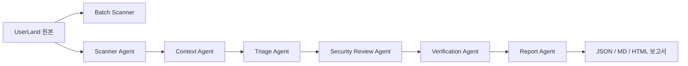

# AI 기반 Multi-Agent SAST for Raspberry Pi UserLand

## 제출 정보

- GitHub 저장소: https://github.com/yeong-yi/ai-sast-userland
- 분석 대상: Raspberry Pi UserLand C/C++ 코드
- 원본 저장소: https://github.com/raspberrypi/userland
- 재현 방법: `./setup_target.ps1`로 원본을 `target/userland`에 내려받은 뒤 분석 스크립트를 실행한다.

## 1. 목표와 문제 정의

오래된 대규모 C/C++ 저장소에서 위험 함수 호출만 나열하면 오탐과 중복이 많고, 전체 코드를 한 번에 AI 입력으로 보내기 어렵다. 이 프로젝트는 위험 호출을 **검토 후보**로만 탐지한 뒤, 필요한 문맥과 원문 근거를 단계적으로 모아 검증하는 SAST 워크플로를 구현했다. 후보가 발견됐다는 사실만으로 실제 취약점이라고 확정하지 않는다.

## 2. 전체 구조와 Multi-Agent 역할



| Agent | 책임 | 신뢰성 장치 |
|---|---|---|
| Scanner | 위험 함수 호출을 검토 후보로 탐지 | 주석·문자열을 가능한 한 제외, 읽기 오류 기록 |
| Context | 포함 함수, 인자, 호출자·피호출자, 주변 코드 수집 | 후보당 코드 크기 제한, 누락·제외 범위 기록 |
| Triage | 중복 원인을 통합하고 우선순위화 | 원본 후보 ID와 통합 이유 보존 |
| Security Review | 입력 경로, 버퍼 크기, 길이 검사, 방어 로직 검토 | 근거 부족 시 정보 부족으로 판정 |
| Verification | 파일·줄 번호·인용 코드·과장 결론 검증 | 인용 62개를 실제 원본과 대조 |
| Report | 전체·제외·정보 부족 결과 생성 | JSON 판정을 임의로 바꾸지 않음 |

외부 LLM API는 사용하지 않았다. 보안 의미 분석 10건은 `human_provided_review`로 명시하고, 프로그램은 그 근거 인용과 구조를 결정론적으로 검증한다.

## 3. 대규모 저장소 분할 처리

UserLand 654개 C/C++ 파일(약 235,816줄)을 경로 순서와 물리 코드 줄 수를 기준으로 3개 안정 배치로 나눴다. 모든 파일은 정확히 한 배치에 들어가며, 배치 결과의 후보 합계를 전체 스캔 결과와 대조한다.

| Batch | 파일 수 | 예상 코드 줄 | 후보 수 | 실행 시간 | 오류 |
|---|---:|---:|---:|---:|---:|
| BATCH-001 | 209 | 78,749 | 378 | 0.756초 | 0 |
| BATCH-002 | 177 | 78,395 | 101 | 0.553초 | 0 |
| BATCH-003 | 268 | 78,672 | 104 | 0.554초 | 0 |
| 합계 | 654 | 235,816 | 583 | 1.863초 | 0 |

상세 실행 결과는 `reports/batch_results.json`에 저장했다.

## 4. 토큰 절약 설계와 도입 이유

| 설계 | 적용 방식 | 도입 이유 |
|---|---|---|
| 코드 batch 분할 | 3개 안정 배치 | 거대 저장소 전체를 한 입력에 넣지 않기 위함 |
| 후보 우선순위 | 583개 후보 중 high 11개를 먼저 선정 | 깊은 검토를 가장 위험한 위치에 집중 |
| 함수 길이 제한 | 후보 함수 최대 140줄 | 긴 함수 전체 전송을 방지 |
| 묶음 크기 제한 | 후보당 최대 220줄 | 문맥 크기 상한을 보장 |
| 호출 관계 제한 | 호출자 2개·피호출자 3개 코드 우선 포함 | 호출 그래프 폭발 방지 |
| 중복 통합 | 11개 원본 후보를 10개 분석 건으로 통합 | 동일 원인의 반복 분석 제거 |
| 선택적 추가 문맥 | 필요한 매크로·구조체만 추가 수집 | 무관한 코드 입력을 줄임 |

중요한 코드가 제한 밖에 있을 가능성은 `excluded_content`와 `missing_information`에 남긴다. 즉, 토큰을 줄이되 불확실성을 숨기지 않는 방식이다.

## 5. AI 프롬프트화 방법

처음의 모호한 요청인 “이 코드에서 취약점을 찾아줘” 대신, 역할별로 입력·출력·금지 사항을 명시했다.

```text
후보를 취약점이라고 단정하지 마라.
인자별 출처, 외부 입력 경로, 버퍼 크기, 문자열 종료, 길이 검사,
반대 근거를 파일·줄 번호와 함께 작성하라.
정보가 없으면 정보 부족으로 남겨라.
```

프롬프트 템플릿과 기대 JSON 스키마는 `config/agent_prompts.json`, 역할별 실제 실행 결과는 `reports/agent_run_log.md`와 `reports/security_review_responses.json`에 보존했다. 이 방식은 분석 근거 형식을 통일하고, 위험 함수가 있다는 이유만으로 결론을 과장하는 문제를 줄인다.

## 6. 분석 결과와 사례

전체 스캔에서 583개 검토 후보를 수집했고, 문맥 묶음도 583개 생성했다. 우선순위 분석 10건의 최종 판정은 다음과 같다.

| 판정 | 건수 |
|---|---:|
| 취약 가능성 높음 | 1 |
| 취약 가능성 낮음 | 8 |
| 정보 부족 | 1 |

최우선 후보는 `AN-010`이다. 명령행 매개변수 값이 두 CLI 경로를 통해 `dtoverlay_foreach_override_target`로 전달되고, 길이 검사 없이 256바이트 `target_value` 배열에 `strcpy`되는 경로가 원문 근거로 확인됐다(`target/userland/helpers/dtoverlay/dtoverlay.c:1852`, `:1859`). 판정은 **취약 가능성 높음(신뢰도 97)** 이지만, 실제 공격 성공·권한 상승·실행 환경의 보호 기법은 검증하지 않았으므로 확정 취약점이라고 주장하지 않는다.

## 7. 차별점

| 단순 위험 함수 검색 | 이 프로젝트 |
|---|---|
| 함수 이름이 있는 줄을 나열 | 포함 함수·인자·호출 관계·주변 코드 수집 |
| 같은 원인을 반복 보고 | 원본 ID를 보존하며 Triage로 통합 |
| 위험 함수 발견을 취약점처럼 보일 수 있음 | 입력 경로·길이 검사·방어 로직·반대 근거를 검토 |
| 원문 인용 검증 없음 | 62개 인용의 파일·줄·코드를 원본과 대조 |
| 불확실성을 누락하기 쉬움 | 낮음·정보 부족을 별도 결과로 보존 |

핵심 가치는 “많이 찾는 도구”가 아니라, **왜 위험한지와 무엇을 아직 모르는지를 재현 가능하게 남기는 도구**라는 점이다.

## 8. 재현 방법

```powershell
.\setup_target.ps1
python src/scanner.py
python src/batch_scanner.py
python src/context_builder.py
python src/analyze_candidates.py
python src/agent_pipeline.py
python src/generate_submission_docs.py
python src/validate_submission.py
```

최종 검증 결과는 12개 항목 모두 통과, 실패 0개다. 후보 수·문맥 묶음 수·3개 배치 합계·원본 인용·보고서 생성·사람 검토 출처·원본 무변경 여부를 검증한다. 상세 결과는 `reports/validation_report.md`에서 확인할 수 있다.

## 9. 한계와 향후 개선

- 함수·호출 관계는 정규식 기반 근사 분석이므로 함수 포인터, 콜백, 매크로, 복잡한 C++ 문법을 놓치거나 잘못 연결할 수 있다.
- 583개 후보 중 10건만 정밀 검토했다.
- 보안 검토는 `human_provided_review`이며 외부 LLM API를 호출하지 않았다.
- 실제 빌드, 동적 재현, Sanitizer, 컴파일 보호 옵션, 실행 권한 경계는 검증하지 않았다.
- 다음 단계는 AN-010의 안전한 동적 재현과 AN-007의 libfdt 문자열 종료 규약 조사다.

## 관련 산출물

- 보안 분석: `reports/security_report.md`, `reports/analysis_results.json`
- 제외·정보 부족 후보: `reports/rejected_candidates.md`, `reports/needs_more_context.md`
- 아키텍처: `reports/architecture.md`
- 토큰 절약 전략: `reports/token_strategy.md`
- 프롬프트 이력: `reports/prompt_history.md`
- 차별점 보고서: `reports/differentiation_report.md`
- 실행 로그: `reports/agent_run_log.md`
- 발표 자료: `reports/AI_Multi_Agent_SAST_UserLand.pptx`, `reports/AI_Multi_Agent_SAST_UserLand.pdf`
