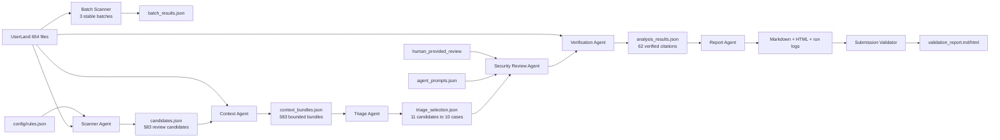

# BugBori 역할 기반 Multi-agent SAST 아키텍처

> 외부 LLM API는 사용하지 않았습니다. 에이전트는 책임·입력·출력이 분리된 재현 가능한 워크플로 단계이며, 보안 의미 분석은 `human_provided_review`로 표시합니다.

## 전체 입력·출력 흐름

## 에이전트 책임과 신뢰성 장치

| Agent | 핵심 책임 | 신뢰성 확보 | 실패 시 처리 |
|---|---|---|---|
| Scanner | 위험 함수 호출 후보 탐지 | 주석·문자열 마스킹, 모든 결과를 review_candidate로 표시 | 읽기 오류를 파일별 기록 |
| Context | 함수·호출자·피호출자·인자 수집 | 코드 줄 제한, 누락과 제외 범위 명시 | 함수를 못 찾으면 missing_information 유지 |
| Triage | 중복 통합과 우선순위 선정 | 원본 후보 ID 중복 금지, high 후보 확인 | 비정상 ID·중복이면 파이프라인 실패 |
| Security Review | 입력 경로·크기·방어 로직 검토 | 사람 검토 출처 명시, 정보 부족 허용 | 근거가 없으면 확정하지 않음 |
| Verification | 파일·줄·인용과 과장 결론 검증 | 62개 인용을 원본과 대조 | 한 줄이라도 불일치하면 보고서 생성 실패 |
| Report | 전체·제외·정보 부족 보고서 생성 | JSON 판정을 변경하지 않고 표현 | 누락 파일은 제출 검증에서 실패 표시 |

## SAST 설계 시 주안점

- **탐지와 확정 분리**: 위험 함수 호출은 시작점이지 취약점 확정이 아닙니다.
- **근거 우선**: 모든 중요한 판단은 파일 경로와 줄 번호를 갖습니다.
- **반대 근거 보존**: 길이 검사와 안전한 할당을 발견하면 낮음 판정에 반영합니다.
- **정보 부족 허용**: 호출 경로나 문자열 규약을 확인할 수 없으면 추측 대신 정보 부족으로 남깁니다.
- **실패 가시성**: 읽기 오류, 누락 함수, 잘린 코드, 검증 실패를 숨기지 않습니다.

## 정규식 호출 관계 분석의 한계

- 함수 포인터, 콜백, 매크로로 만들어진 호출을 놓칠 수 있습니다.
- 같은 함수 이름이 여러 파일에 있으면 잘못 연결될 수 있습니다.
- C++ 템플릿·오버로드·조건부 컴파일을 완전하게 해석하지 못합니다.
- 따라서 호출 관계의 신뢰도는 `regex_approximation_requires_review`이며 최종 검증에서 원문을 다시 봅니다.
